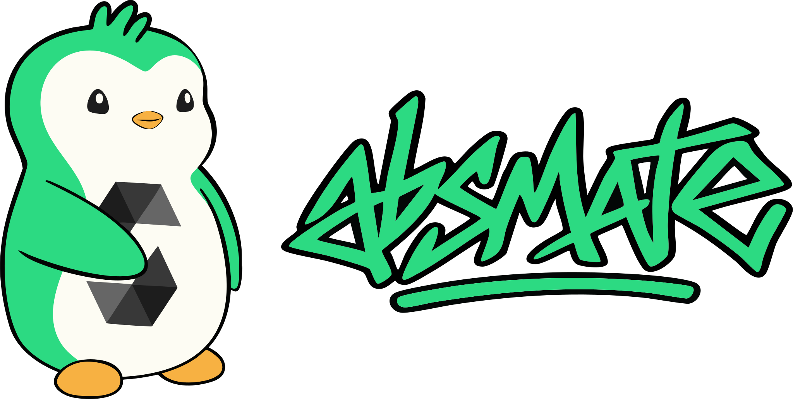

# 

A collection of helpful utilities for building contracts on [Abstract](https://abs.xyz)

## Installation


To install with [**Foundry**](https://github.com/foundry-rs/foundry):

```sh
forge install abstract-foundation/absmate
```

Ensure you include the following in your `foundry.toml` as some libraries may require system contract calls.
```toml
[profile.default.zksync]
enable_eravm_extensions = true
```

Add `absmate/=lib/absmate/` to your `remappings.txt`.

## Contracts

The Solidity smart contracts are located in the `src` directory.

```ml
utils
├─ LibAGW - "Utilities for AGW smart accounts"
├─ LibClone — "Clones for ZKsync"
└─ LibEVM — "Detection of EVM bytecode contracts"
```

## Contributing

This repository is designed as a playground for helpful snippets when developing smart contracts for [Abstract](https://docs.abs.xyz/build-on-abstract/getting-started)

Feel free to make a pull request.

## Safety

This is **experimental software** and is provided on an "as is" and "as available" basis.

We **do not give any warranties** and **will not be liable for any loss** incurred through any use of this codebase.

Please always include your own thorough tests when using absmate to make sure it works correctly with your code.